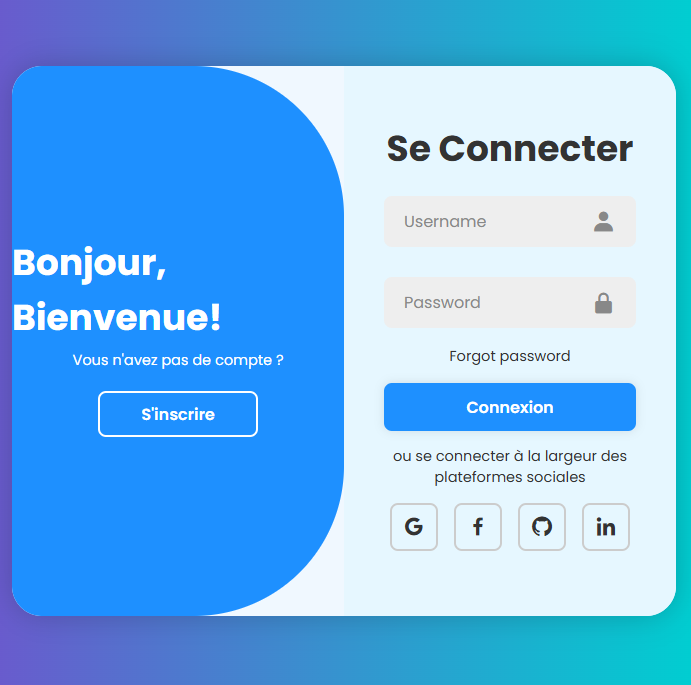
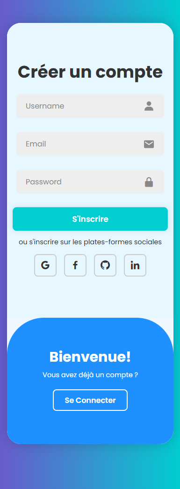

# Formulaire de Connexion et d'Inscription Réactif

## Aperçu
   
   

## Description

Ce projet est un formulaire de connexion et d'inscription réactif, développé en HTML, CSS et JavaScript. Il offre une interface utilisateur attrayante et facile à utiliser pour la connexion et l'inscription des utilisateurs. Le design est inspiré par des tendances modernes et utilise des icônes pour améliorer l'expérience utilisateur.

## Fonctionnalités

- **Formulaire de connexion** : Permet aux utilisateurs de se connecter avec leur nom d'utilisateur et leur mot de passe.
- **Formulaire d'inscription** : Permet aux nouveaux utilisateurs de créer un compte en fournissant leur nom d'utilisateur, leur adresse e-mail et leur mot de passe.
- **Icônes sociales** : Options pour se connecter via des plateformes sociales (Google, Facebook, GitHub, LinkedIn).
- **Indicateur de force du mot de passe** : Affiche la force du mot de passe lors de sa saisie.
- **Réactivité** : Adapté aux mobiles et aux écrans de différentes tailles.

## Technologies Utilisées

- HTML
- CSS
- JavaScript
- [Boxicons](https://boxicons.com/) pour les icônes

## Installation

1. Clonez le dépôt :
   ```bash
   git clone git@github.com:val-art01/WebAuthForm.git

## Source
Ce projet a été réalisé en suivant un tutoriel YouTube. Vous pouvez consulter la vidéo d'origine [ici](https://www.youtube.com/watch?v=Z_AbWH-Vyl8). Merci au créateur de la vidéo pour ses instructions claires et utiles.

## Utilisation Équitable
Ce projet est destiné à des fins éducatives et respecte les principes d'utilisation équitable. Les éléments utilisés dans le projet ne violent pas les droits d'auteur, et il est à des fins non lucratives.

## License
Ce projet est à des fins éducatives et respecte la clause de non-responsabilité concernant les droits d'auteur. Veuillez consulter la vidéo d'origine pour plus de détails.
